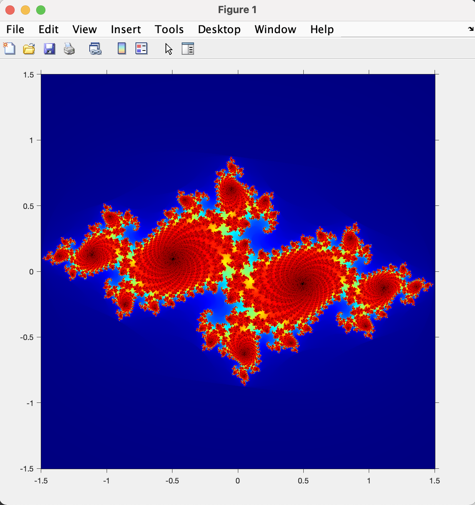
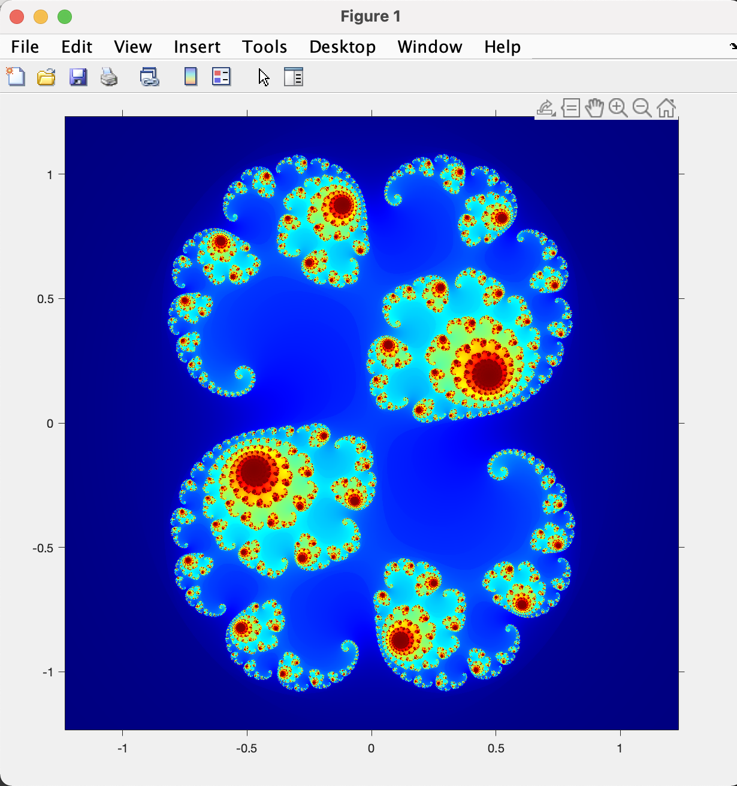
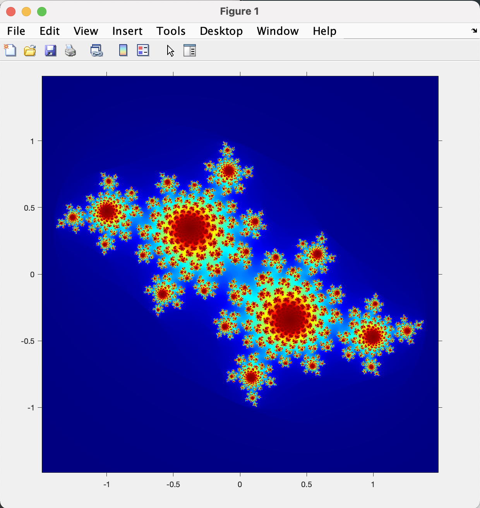

## Overview

In this program, we create figures to visualize julia sets, sets of complex numbers that generate bounded sequences.

##### Grade Recieved: 100/100

### Command Run

```
julia(-0.7269 + 0.1889i)
```



```
julia(0.285 + 0.01i)
```



```
julia(-0.4 + .6i)
```



##### Please refer to README.pdf for more assignment description
